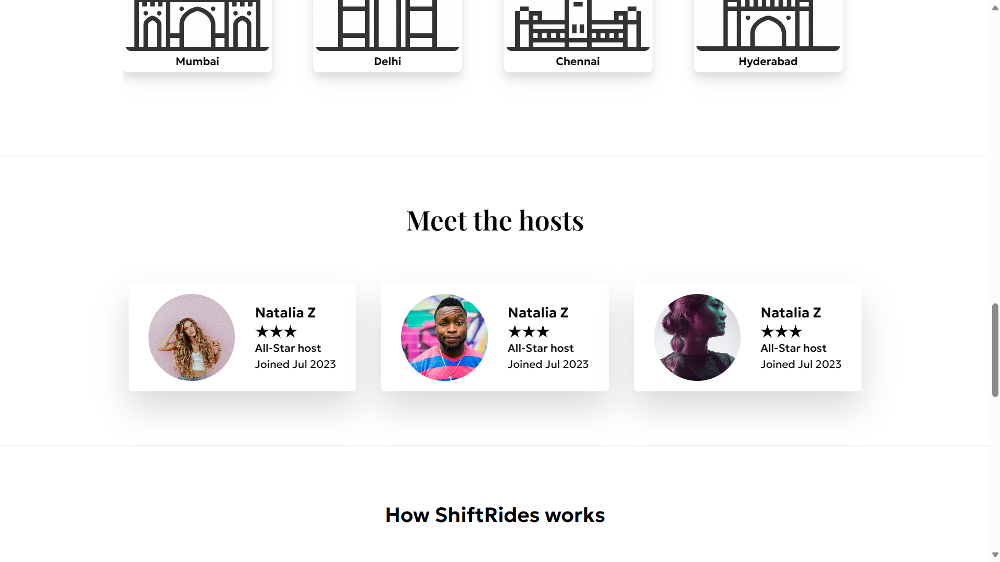
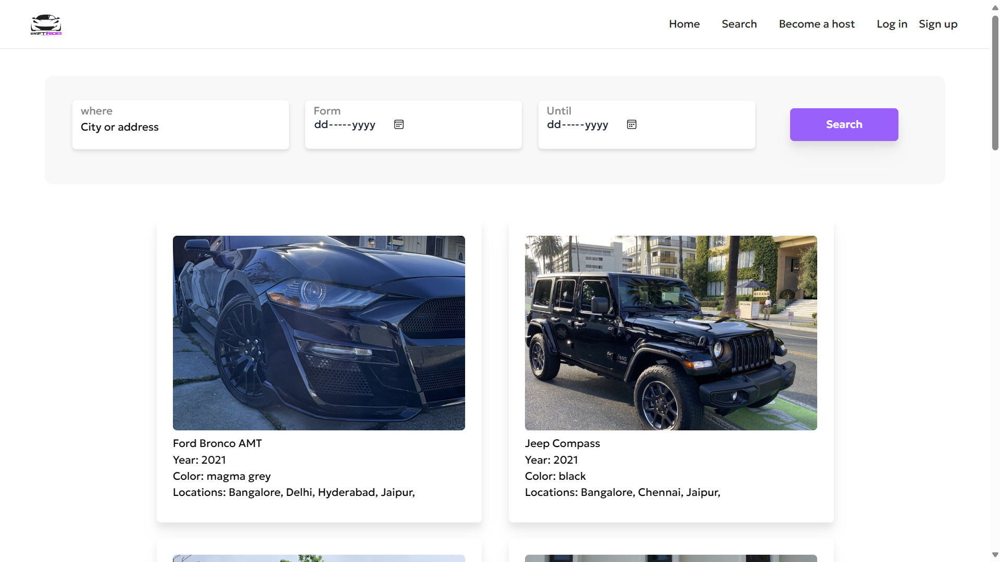

# SwiftRides - Car Renting Website

SwiftRides is a car renting website developed using HTML, CSS, JavaScript, Bootstrap, Tailwind CSS, Python, and Django. This project is an ongoing internship project given by EY, AICTE, and NextGen Edunet Foundation.


## Features

- User authentication: Allow users to sign up, log in, and log out . 
- Responsive design: Ensure the website is optimized for various devices and screen sizes.
- Car listings: Display available cars for rent with details such as model, price, and availability . 
- Dynamic Data Fetching: Implement a server-side API that dynamically retrieves car data from the database and populates the web page without the need for creating individual HTML pages for each car. This approach will ensure that the website remains scalable and easy to update, while also providing a seamless user experience.
- Admin panel: Provide admin access to manage cars, bookings, and users.
- Booking system: Enable users to book cars for specific dates (working on).

## Technologies Used

- HTML
- CSS
- JavaScript
- Bootstrap
- Tailwind CSS
- Python
- Django
- Sqlite

## Prerequisites

Before you begin, ensure you have the following installed:
- Python 3.8 or higher
- Node.js and npm
- Git

## Installation & Setup

### 1. Clone the repository:
```bash
git clone https://github.com/Chethan814/Swift-Rides.git
```

### 2. Navigate to the project directory:
```bash
cd Swift-Rides
```

### 3. Navigate to the Django project directory:
```bash
cd car-renting-app/SwiftRides
```

### 4. Activate the virtual environment:

**For Windows PowerShell:**
```powershell
# First, enable script execution (if not already enabled)
Set-ExecutionPolicy -ExecutionPolicy RemoteSigned -Scope CurrentUser

# Navigate to the virtual environment directory
cd ..
.\Scripts\Activate.ps1

# Navigate back to the Django project
cd SwiftRides
```

**For Windows Command Prompt:**
```cmd
cd ..
.\Scripts\activate.bat
cd SwiftRides
```

**For Linux/Mac:**
```bash
cd ..
source Scripts/activate
cd SwiftRides
```

### 5. Install Python dependencies:
```bash
python -m pip install -r requirements.txt
```

### 6. Install Node.js dependencies:
```bash
npm install
```

### 7. Run database migrations:
```bash
python manage.py migrate
```

## Running the Application

### Start the Django development server:
```bash
python manage.py runserver
```

### Start Tailwind CSS (in a separate terminal):
```bash
# Open a new terminal window and navigate to the same directory
cd car-renting-app
.\Scripts\Activate.ps1  # Activate virtual environment
cd SwiftRides
python manage.py tailwind start
```

### Access the website:
Open your browser and go to: `http://127.0.0.1:8000/`

## Project Structure

```
Swift-Rides/
├── car-renting-app/          # Virtual environment directory
│   ├── Scripts/              # Virtual environment scripts
│   ├── Lib/                  # Virtual environment libraries
│   └── SwiftRides/           # Django project directory
│       ├── manage.py         # Django management script
│       ├── requirements.txt  # Python dependencies
│       ├── package.json      # Node.js dependencies
│       ├── SwiftRides/       # Django settings
│       ├── home/             # Main app
│       ├── user_profile/     # User authentication app
│       ├── theme/            # Tailwind CSS theme
│       ├── templates/        # HTML templates
│       ├── static/           # Static files
│       └── media/            # User-uploaded files
└── readme/                   # Project documentation
```

## Troubleshooting

### PowerShell Execution Policy Error
If you encounter a PowerShell execution policy error, run:
```powershell
Set-ExecutionPolicy -ExecutionPolicy RemoteSigned -Scope CurrentUser
```

### Virtual Environment Issues
If the virtual environment doesn't work, create a new one:
```bash
python -m venv venv
.\venv\Scripts\Activate.ps1  # Windows
source venv/bin/activate     # Linux/Mac
pip install -r requirements.txt
```

### Port Already in Use
If port 8000 is already in use, specify a different port:
```bash
python manage.py runserver 8001
```

## Contributing

Contributions are welcome! If you'd like to contribute to this project, please fork the repository and create a pull request.

## License

This project is licensed under the [MIT License](LICENSE). You are free to use, modify, and distribute this software for any purpose, subject to the terms of the license agreement.

## Acknowledgements

Special thanks to EY, AICTE, and NextGen Edunet Foundation for providing this internship opportunity and project.


## Images






## Certification from the Next Gen Edunet Foundation , EY-GDS , AICTE


     


